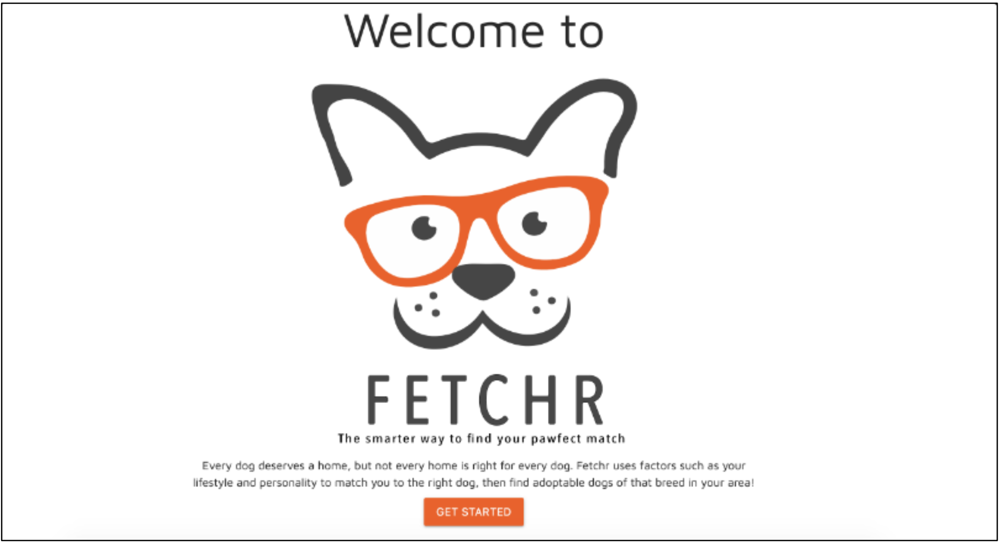

# FETCHR
A best-breed match app for adopting dogs. 
Utilized HTML, JavaScript, Materialize, and Sequelize.

## Purpose 
The application aims to match users with an ideal dog breed and then connect them with an adoptable dog of that breed from a local shelter via the PetFinder API.
It begins with a survey that asks about the user's living situation, lifestyle, and personality.
The answers are compared to unique traits like "exercise needs" for over 140 dog breeds.
Using Euclidean Distance, the algorithm finds the closest match to the user's ideal dog, presenting the top six options for selection.
Users can then find adoptable dogs of their chosen breed near their location.

## App Features
* Analyzes user lifestyle to find the best-matched breed.
* Displays adoptable dogs from shelters near the user's location.

## My Contributions
Led front-end and back-end development for:
* Questionnaires designed to determine the best-matched breed.
* Implementation of a list displaying adoptable pets of the recommended breed.

## Technology
- Materialize CSS library
- Sequelize
- PetFinder API

## Dependencies
- sql seed file which contains the questions, choices, breeds, and attributes
- axios
- body-parser
- dotenv
- express
- express-handlebars
- express-session
- html-entities
- mysql2
- underscore

## Preview
You can visit the site [here](https://penn-project2.herokuapp.com/)

